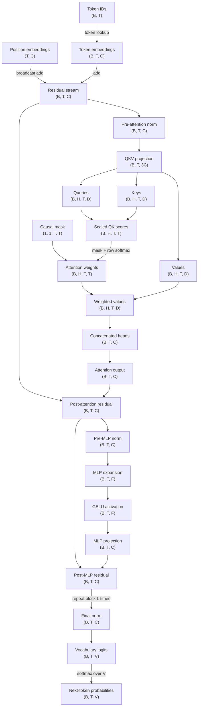

# Day 12 — GPT Dataflow and Tensor Shapes

**Date:** 2026-09-16

## Goal

Trace a decoder-only GPT from token IDs to next-token probabilities while keeping
every tensor shape explicit. The symbols used below are:

- `B`: batch size
- `T`: sequence length
- `V`: vocabulary size
- `C`: model width
- `H`: number of attention heads
- `D = C / H`: width of one head
- `F`: MLP hidden width
- `L`: number of repeated transformer blocks

## Full block diagram



The residual stream always keeps shape `(B, T, C)`. Attention temporarily splits
`C` into `H` heads of width `D`, creates a `(T, T)` score matrix for every batch
item and head, and then concatenates the heads back to `C`. The MLP expands only
the channel dimension from `C` to `F` and projects it back before the residual add.

## Executable shape ledger

`src/ai_journey/transformer_shapes.py` models 24 tensors and 27 operation edges.
It rejects invalid head dimensions, unknown nodes, cycles, and key shape breaks.
It also renders the complete graph, a symbolic-and-concrete shape table, and a
parameter-count breakdown without requiring a machine-learning framework.

```bash
python scripts/run_day_12.py \
  --batch-size 2 \
  --context-length 8 \
  --vocab-size 32000 \
  --d-model 256 \
  --n-heads 8 \
  --d-ff 1024 \
  --n-layers 4 \
  --output artifacts/day-12-gpt-shapes.md
```

## Sources scheduled by the curriculum

- Primary — *Transformers, the tech behind LLMs | Chapter 5*:
  https://www.youtube.com/watch?v=wjZofJX0v4M
- Support — *Cross products in the light of linear transformations*:
  https://www.youtube.com/watch?v=BaM7OCEm3G0

These links and topics come from the canonical workbook. They are planning input,
not evidence that either lecture was watched.

## Evidence status

The deterministic reference implementation, diagram, shape validator, CLI, and
tests are present. Ajay still needs to watch the scheduled lectures, draw the GPT
block diagram from memory without opening this reference, label every shape, and
compare that drawing with the validated ledger. No personal completion is claimed.
