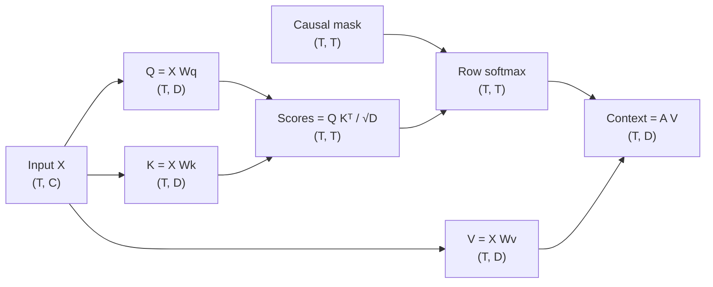

# Day 13 — Scaled Dot-Product Attention in NumPy

**Date:** 2026-09-17

## Goal

Implement one attention head with explicit query, key, value, score, mask,
probability, and context tensors. The executable lesson uses random inputs and
weights generated from a fixed seed. It does not train a model or claim that the
scheduled lectures were watched.

## Dataflow and shapes



For query position `i` and key position `j`:

```text
score[i, j] = dot(Q[i], K[j]) / sqrt(D)
weight[i, :] = masked_softmax(score[i, :])
context[i] = sum_j weight[i, j] * V[j]
```

The dot product measures query–key compatibility. Dividing by `sqrt(D)` keeps
score magnitudes from growing with the head width. The row-wise softmax converts
scores to non-negative weights that sum to one. In causal mode, every weight
above the diagonal is exactly zero, so token `i` cannot read a future token.

## Reproducible experiment

[`attention.py`](../src/ai_journey/attention.py) contains both the vectorized
implementation and an independent loop implementation. The validator checks:

- every expected shape;
- finite inputs and outputs;
- non-negative attention weights;
- a sum of one for every probability row;
- exactly zero weight at masked positions; and
- agreement between vectorized and loop implementations.

Run the default causal experiment:

```bash
python scripts/run_day_13.py \
  --sequence-length 4 \
  --model-dim 6 \
  --head-dim 3 \
  --seed 13 \
  --output artifacts/day-13-attention.md \
  --json-output artifacts/day-13-attention.json
```

Use `--non-causal` to compare full attention with the causal result. This is a
controlled shape-and-numerics exercise. It is not a trained attention head and
its random matrices have no learned meaning.

## Questions to answer after running it

1. Why does each score row have length `T` rather than `D`?
2. Why must softmax operate across keys for each query?
3. What changes in the first row when the causal mask is removed?
4. Why does the first causal context vector equal the first value vector?
5. What remains independent across heads in multi-head attention?

Record the seed, command, generated report path, and your answers. Those are
manual learner evidence and are intentionally still pending.

## Sources scheduled by the curriculum

- Primary — *Attention in transformers, step-by-step | Chapter 6*:
  https://www.youtube.com/watch?v=eMlx5fFNoYc
- Support — *Cramer's rule, explained geometrically*:
  https://www.youtube.com/watch?v=jBsC34PxzoM

These links and topics come from the canonical workbook. They are planning input,
not evidence that either lecture was watched.

## Evidence status

The deterministic NumPy implementation, independent reference calculation,
invariant validator, CLI, lesson diagram, and automated tests are present. Ajay
still needs to watch or explicitly skip the scheduled lectures, run the exercise,
and answer the reflection questions. No personal completion is claimed.
