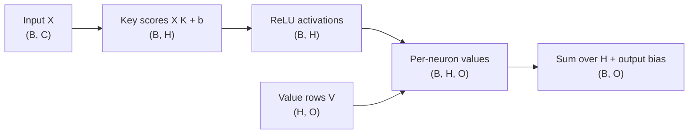

# Day 14 — MLPs as Key/Value Memories

**Date:** 2026-09-18

## Goal

Unpack the two matrix multiplications in a transformer MLP and test three ideas
with small deterministic arrays:

1. an MLP output can be written exactly as a sum of per-neuron value vectors;
2. a change of input basis changes the coordinates, not the function; and
3. representing more features than dimensions creates interference.

The implementation is a teaching model. It does not claim that a real model
stores one fact in one neuron, and its parameters are constructed rather than
learned.

## The MLP expansion

For a batch `X`, key matrix `K`, hidden bias `b`, value matrix `V`, and output
bias `c`:

```text
H = ReLU(X K + b)
Y = H V + c
```

If `h[i]` is one hidden activation and `V[i]` is one row of the value matrix,
the same output is:

```text
Y = sum_i h[i] * V[i] + c
```

This equality motivates the key/value-memory view. A column of `K` selects an
input pattern, the nonlinearity gates it, and the matching row of `V` contributes
a direction to the output. The report checks this expansion against the usual
matrix expression and requires a maximum error no larger than `1e-12`.



## Change of basis

For invertible `B`, transform row-vector inputs and keys as:

```text
X' = X B
K' = B^-1 K
X' K' = X B B^-1 K = X K
```

The neuron preactivations and outputs remain the same even though every input
coordinate and key coordinate changes. This is a concrete link to the scheduled
change-of-basis lesson: coordinates depend on a basis, while the represented
linear map can stay invariant.

## Superposition and interference

The second toy model places five unit feature directions in a two-dimensional
space, then encodes and decodes non-negative feature vectors:

```text
representation = features @ W.T
reconstruction = ReLU(representation @ W - bias)
```

Because five directions cannot all be orthogonal in two dimensions, their Gram
matrix has non-zero off-diagonal entries. The experiment measures the largest
absolute off-diagonal dot product as feature coherence. It then compares sparse
one-feature examples with a deliberately colliding two-feature example. The
collision has higher reconstruction error, making the capacity/interference
tradeoff visible without training a large model.

## Reproducible experiment

```bash
python scripts/run_day_14.py \
  --output artifacts/day-14-mlp-memory.md \
  --json-output artifacts/day-14-mlp-memory.json
```

The command fails unless the key/value expansion is exact, the direct and
expanded forms agree, change-of-basis invariance holds, and the selected feature
collision raises reconstruction error.

## What the evidence does and does not establish

The exact decomposition is algebra. The change-of-basis check is algebra plus a
numerical verification. The superposition result is evidence about this toy
model only. Research has found useful key/value and superposition perspectives,
but the location and mechanism of factual knowledge in real language models
remain active research questions.

## Phase 1 review evidence still needed

Ajay must supply the personal parts of the scheduled review:

1. Confirm or explicitly skip both Day 14 lectures.
2. Run the command above and record the report paths.
3. Explain why the key/value expansion is exact but the interpretation is a
   hypothesis about learned models.
4. Explain why basis invariance makes individual coordinates hard to interpret.
5. Explain why sparse features can share dimensions and why collisions cost
   accuracy.
6. Write the scheduled 500-word “What I learned in 14 days” reflection in his
   own words. Cover one concept that became clearer, one experiment that failed
   or surprised him, one remaining gap, and the next concrete practice goal.
7. Publish the reflection only if desired, then add the public link or an
   explicit private/not-published note to the repository evidence.

No lecture viewing, personal reflection, or publication is claimed here.

## Sources

- Curriculum lesson: 3Blue1Brown, *How might LLMs store facts?*:
  https://www.3blue1brown.com/lessons/mlp/
- Scheduled support lesson: 3Blue1Brown, *Change of basis*:
  https://www.youtube.com/watch?v=P2LTAUO1TdA
- Geva et al., *Transformer Feed-Forward Layers Are Key-Value Memories*:
  https://arxiv.org/abs/2012.14913
- Elhage et al., *Toy Models of Superposition*:
  https://transformer-circuits.pub/2022/toy_model/index.html

The first two sources are the canonical workbook assignments. The research
sources support the interpretation and its limitations; they do not prove that
Ajay watched the scheduled material.
