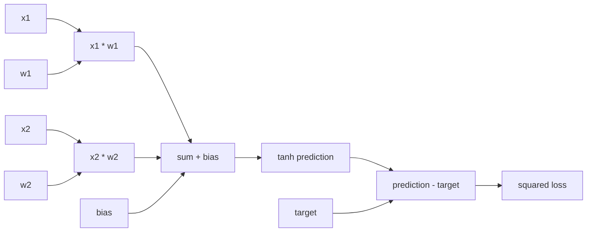

# Day 15 — Scalar Values and Reverse-Mode Autodiff

**Date:** 2026-09-19

## Goal

Build the smallest useful automatic-differentiation system from scalar values.
Every arithmetic result remembers its parents and a local derivative rule. Those
links form a directed acyclic graph (DAG). A reverse pass applies the chain rule
from the final scalar back to every reachable input.

The workbook asks for a typed-along `Value` class with addition and
multiplication. The repository supplies an independently written reference and
tests. Ajay's personal type-along remains separate learner evidence.

## A `Value` records two things

A scalar node stores its forward value and its accumulated gradient. An
operation such as multiplication creates a new node and records its two parent
nodes:

```text
c = a * b
c.data = a.data * b.data
dc/da = b.data
dc/db = a.data
```

During backpropagation, the gradient already accumulated at `c` multiplies each
local derivative:

```text
a.grad += b.data * c.grad
b.grad += a.data * c.grad
```

The `+=` matters. If one value influences the output along two graph paths, the
multivariable chain rule adds both contributions.

## Why the graph must be a DAG

The forward expression creates dependencies from parent values to results. A
topological order lists each parent before any result that needs it. Reversing
that order guarantees that a node receives downstream gradient contributions
before its own local backward rule runs.



The implementation detects a malformed cycle rather than recursing forever. A
shared subexpression appears once in the topological order while still
contributing through every outgoing path.

## Independent gradient check

The deterministic experiment builds a two-input tanh neuron and squared-error
loss:

```text
prediction = tanh(x1*w1 + x2*w2 + bias)
loss = (prediction - target)^2
```

For each of the six scalar inputs, the report compares the reverse-mode
gradient with a centered finite difference:

```text
df/dx ≈ [f(x + epsilon) - f(x - epsilon)] / (2 * epsilon)
```

The numerical calculation rebuilds the expression at both perturbed points. It
therefore checks the autodiff graph through a different computation path. The
command fails if any error exceeds its absolute-plus-relative tolerance.

## Reproducible experiment

```bash
python scripts/run_day_15.py \
  --output artifacts/day-15-scalar-autodiff.md \
  --json-output artifacts/day-15-scalar-autodiff.json
```

The Markdown report includes the stable graph, node values, propagated
gradients, and all six analytic-versus-numerical comparisons. The JSON file is
machine-readable evidence for later milestone reviews.

## What the evidence does and does not establish

The repository verifies scalar arithmetic, local derivative rules, shared-path
gradient accumulation, reverse topological traversal, cycle rejection, graph
serialization, and finite-difference agreement. It does not establish tensor
broadcasting, production performance, lecture completion, or completion of the
Week 3 MLP gate.

## Learner evidence still needed

1. Confirm or explicitly skip the assigned Day 15 lecture segment and support
   video.
2. Type a fresh `Value` class with `__add__` and `__mul__` without copying this
   implementation, then record the commit or notebook path.
3. Run the command above and record both report paths.
4. Explain why reverse topological order is required.
5. Explain why gradients accumulate with `+=` for a shared subexpression.
6. Draw one computation graph from memory and label a local derivative at every
   operation.

No lecture viewing, type-along, or personal explanation is claimed here.

## Sources

- Curriculum lesson: Andrej Karpathy, *The spelled-out intro to neural networks
  and backpropagation: building micrograd*:
  https://www.youtube.com/watch?v=VMj-3S1tku0
- Scheduled support lesson: 3Blue1Brown, *Eigenvectors and eigenvalues*:
  https://www.youtube.com/watch?v=PFDu9oVAE-g

Both sources are canonical workbook assignments. Their inclusion records the
plan; it does not prove that Ajay watched them.
